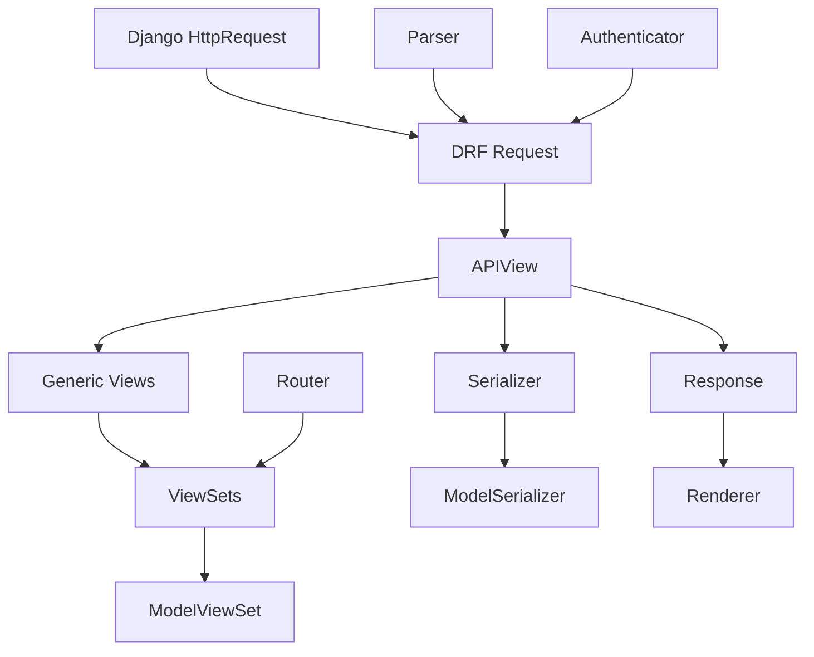

## Introduction

Django REST Framework (DRF) is built on a modular, composable architecture that extends Django's class-based views. Understanding this architecture helps you build maintainable APIs and customize behavior when needed.

<Info>
  DRF version 3.16.1 supports Python 3.10+ and Django 4.2 through 6.0
</Info>

## Core Design Principles

DRF follows several key design principles that shape its architecture:

### 1. Separation of Concerns

Each component has a single, well-defined responsibility:

- **Serializers**: Data transformation and validation
- **Views**: Request handling and business logic
- **Routers**: URL configuration
- **Parsers**: Request content interpretation
- **Renderers**: Response content generation
- **Authentication/Permissions**: Security policies

### 2. Composability

Components are designed to work together through well-defined interfaces. You can mix and match different authentication, permission, pagination, and filtering classes.

```python
class ArticleViewSet(viewsets.ModelViewSet):
    # Compose different policy classes
    authentication_classes = [SessionAuthentication, TokenAuthentication]
    permission_classes = [IsAuthenticatedOrReadOnly]
    pagination_class = PageNumberPagination
    filter_backends = [DjangoFilterBackend, SearchFilter]
```

### 3. Progressive Disclosure

DRF offers multiple levels of abstraction:

- **Function-based views**: Full control, minimal abstraction
- **APIView**: Basic DRF features
- **Generic views**: Common patterns built-in
- **ViewSets + Routers**: Maximum automation

<Tip>
  Start with higher-level abstractions (ViewSets) and drop down to lower levels (APIView or function-based views) only when you need more control.
</Tip>

## Component Hierarchy



## The Request-Response Pipeline

Here's how a typical API request flows through DRF:

### 1. Request Initialization

The `APIView.dispatch()` method wraps Django's HttpRequest:

```python
# From rest_framework/views.py:391
def initialize_request(self, request, *args, **kwargs):
    """Returns the initial request object."""
    parser_context = self.get_parser_context(request)
    
    return Request(
        request,
        parsers=self.get_parsers(),
        authenticators=self.get_authenticators(),
        negotiator=self.get_content_negotiator(),
        parser_context=parser_context
    )
```

### 2. Initial Processing

The `initial()` method runs before the handler:

```python
# From rest_framework/views.py:405
def initial(self, request, *args, **kwargs):
    """Runs anything that needs to occur prior to calling the method handler."""
    self.format_kwarg = self.get_format_suffix(**kwargs)
    
    # Perform content negotiation
    neg = self.perform_content_negotiation(request)
    request.accepted_renderer, request.accepted_media_type = neg
    
    # Determine the API version
    version, scheme = self.determine_version(request, *args, **kwargs)
    request.version, request.versioning_scheme = version, scheme
    
    # Security checks
    self.perform_authentication(request)
    self.check_permissions(request)
    self.check_throttles(request)
```

<Note>
  Authentication is performed **lazily**. Calling `perform_authentication()` just accesses `request.user`, which triggers the actual authentication.
</Note>

### 3. Handler Execution

The view method (GET, POST, etc.) executes:

```python
# Get the appropriate handler method
if request.method.lower() in self.http_method_names:
    handler = getattr(self, request.method.lower(),
                      self.http_method_not_allowed)
else:
    handler = self.http_method_not_allowed

response = handler(request, *args, **kwargs)
```

### 4. Response Finalization

The response is prepared for rendering:

```python
# From rest_framework/views.py:424
def finalize_response(self, request, response, *args, **kwargs):
    """Returns the final response object."""
    if isinstance(response, Response):
        if not getattr(request, 'accepted_renderer', None):
            neg = self.perform_content_negotiation(request, force=True)
            request.accepted_renderer, request.accepted_media_type = neg
        
        response.accepted_renderer = request.accepted_renderer
        response.accepted_media_type = request.accepted_media_type
        response.renderer_context = self.get_renderer_context()
    
    return response
```

## Policy Classes

DRF uses **policy classes** to implement cross-cutting concerns. These are configurable at multiple levels:

### Configuration Hierarchy

1. **Global settings** (in `settings.py`):

```python
REST_FRAMEWORK = {
    'DEFAULT_RENDERER_CLASSES': [
        'rest_framework.renderers.JSONRenderer',
    ],
    'DEFAULT_PERMISSION_CLASSES': [
        'rest_framework.permissions.IsAuthenticated',
    ],
}
```

2. **View-level** (class attributes):

```python
class ArticleViewSet(viewsets.ModelViewSet):
    permission_classes = [IsAuthenticatedOrReadOnly]
```

3. **Method-level** (decorators):

```python
class ArticleViewSet(viewsets.ModelViewSet):
    @action(detail=True, permission_classes=[IsAdminUser])
    def publish(self, request, pk=None):
        pass
```

### Available Policy Classes

| Policy Type | Purpose | Examples |
|-------------|---------|----------|
| `renderer_classes` | Output format | JSONRenderer, BrowsableAPIRenderer |
| `parser_classes` | Input parsing | JSONParser, FormParser |
| `authentication_classes` | Identity verification | SessionAuthentication, TokenAuthentication |
| `permission_classes` | Access control | IsAuthenticated, DjangoModelPermissions |
| `throttle_classes` | Rate limiting | UserRateThrottle, AnonRateThrottle |

## ViewSet Architecture

ViewSets are one of DRF's most powerful abstractions. They differ from regular views in a fundamental way:

### The ViewSetMixin Magic

```python
# From rest_framework/viewsets.py:45-56
class ViewSetMixin:
    """
    Overrides `.as_view()` so that it takes an `actions` keyword that performs
    the binding of HTTP methods to actions on the Resource.
    
    For example, to create a concrete view binding the 'GET' and 'POST' methods
    to the 'list' and 'create' actions...
    
    view = MyViewSet.as_view({'get': 'list', 'post': 'create'})
    """
```

ViewSets don't define HTTP method handlers (`get()`, `post()`, etc.). Instead, they define **actions** (`list()`, `create()`, `retrieve()`, etc.).

### Method-to-Action Binding

This binding happens in `as_view()`:

```python
# From rest_framework/viewsets.py:116-118
for method, action in actions.items():
    handler = getattr(self, action)
    setattr(self, method, handler)
```

The router automatically creates these bindings:

```python
# Routers generate standard mappings
route = Route(
    url=r'^{prefix}{trailing_slash}$',
    mapping={
        'get': 'list',
        'post': 'create'
    },
    name='{basename}-list',
)
```

## Router System

Routers automatically generate URL patterns from ViewSets.

### How Routers Work

```python
# From rest_framework/routers.py:266-311
def get_urls(self):
    """Use the registered viewsets to generate a list of URL patterns."""
    ret = []
    
    for prefix, viewset, basename in self.registry:
        lookup = self.get_lookup_regex(viewset)
        routes = self.get_routes(viewset)
        
        for route in routes:
            # Only bind actions that exist on the viewset
            mapping = self.get_method_map(viewset, route.mapping)
            if not mapping:
                continue
            
            # Build the url pattern
            regex = route.url.format(
                prefix=prefix,
                lookup=lookup,
                trailing_slash=self.trailing_slash
            )
            
            view = viewset.as_view(mapping, **initkwargs)
            name = route.name.format(basename=basename)
            ret.append(self._url_conf(regex, view, name=name))
    
    return ret
```

### Standard Routes

The `SimpleRouter` creates these URL patterns:

| URL Pattern | HTTP Method | Action | Name |
|-------------|-------------|--------|------|
| `/{prefix}/` | GET | list | `{basename}-list` |
| `/{prefix}/` | POST | create | `{basename}-list` |
| `/{prefix}/{pk}/` | GET | retrieve | `{basename}-detail` |
| `/{prefix}/{pk}/` | PUT | update | `{basename}-detail` |
| `/{prefix}/{pk}/` | PATCH | partial_update | `{basename}-detail` |
| `/{prefix}/{pk}/` | DELETE | destroy | `{basename}-detail` |

### Extra Actions

The `@action` decorator adds custom endpoints:

```python
class ArticleViewSet(viewsets.ModelViewSet):
    @action(detail=True, methods=['post'])
    def publish(self, request, pk=None):
        article = self.get_object()
        article.published = True
        article.save()
        return Response({'status': 'published'})
```

This generates: `POST /articles/{pk}/publish/`

## Exception Handling

DRF provides centralized exception handling:

```python
# From rest_framework/views.py:72-102
def exception_handler(exc, context):
    """
    Returns the response that should be used for any given exception.
    
    By default we handle the REST framework `APIException`, and also
    Django's built-in `Http404` and `PermissionDenied` exceptions.
    """
    if isinstance(exc, Http404):
        exc = exceptions.NotFound(*(exc.args))
    elif isinstance(exc, PermissionDenied):
        exc = exceptions.PermissionDenied(*(exc.args))
    
    if isinstance(exc, exceptions.APIException):
        headers = {}
        if getattr(exc, 'auth_header', None):
            headers['WWW-Authenticate'] = exc.auth_header
        
        data = {'detail': exc.detail}
        set_rollback()  # Rollback database transactions
        return Response(data, status=exc.status_code, headers=headers)
    
    return None  # 500 error
```

<Tip>
  You can customize exception handling by setting `EXCEPTION_HANDLER` in your settings or overriding `get_exception_handler()` on your view.
</Tip>

## Content Negotiation

DRF automatically selects the appropriate renderer based on:

1. The `Accept` header in the request
2. The format suffix in the URL (e.g., `.json`)
3. The `format` query parameter

```python
# Content negotiation happens in perform_content_negotiation()
renderers = self.get_renderers()
conneg = self.get_content_negotiator()

try:
    return conneg.select_renderer(request, renderers, self.format_kwarg)
except Exception:
    if force:
        return (renderers[0], renderers[0].media_type)
    raise
```

## Best Practices

### 1. Use the Right Abstraction Level

```python
# Too low-level for CRUD operations
@api_view(['GET', 'POST'])
def article_list(request):
    if request.method == 'GET':
        # ...
    elif request.method == 'POST':
        # ...

# Better: Use ViewSets for standard CRUD
class ArticleViewSet(viewsets.ModelViewSet):
    queryset = Article.objects.all()
    serializer_class = ArticleSerializer
```

### 2. Override at the Right Level

```python
# Override methods to customize behavior
class ArticleViewSet(viewsets.ModelViewSet):
    
    def get_queryset(self):
        """Filter queryset based on user"""
        if self.request.user.is_staff:
            return Article.objects.all()
        return Article.objects.filter(published=True)
    
    def perform_create(self, serializer):
        """Set author on creation"""
        serializer.save(author=self.request.user)
```

### 3. Keep Views Thin

Push business logic into:
- **Serializers**: Validation and data transformation
- **Models**: Domain logic
- **Managers**: Query logic

```python
# Good: Business logic in serializer
class ArticleSerializer(serializers.ModelSerializer):
    def validate_title(self, value):
        if Article.objects.filter(title=value).exists():
            raise serializers.ValidationError("Title must be unique")
        return value

# View stays simple
class ArticleViewSet(viewsets.ModelViewSet):
    queryset = Article.objects.all()
    serializer_class = ArticleSerializer
```

## Summary

DRF's architecture is built around:

1. **Request/Response wrapper**: Enhanced Django request/response objects
2. **APIView base class**: Implements the request-response pipeline
3. **Generic views**: Reusable patterns for common operations
4. **ViewSets**: Action-based views for resource-oriented APIs
5. **Routers**: Automatic URL configuration
6. **Policy classes**: Pluggable components for cross-cutting concerns

This modular design allows you to start simple and add complexity only where needed.

<Note>
  The next sections dive deeper into specific components: Serialization, Views & ViewSets, and the Request-Response Cycle.
</Note>