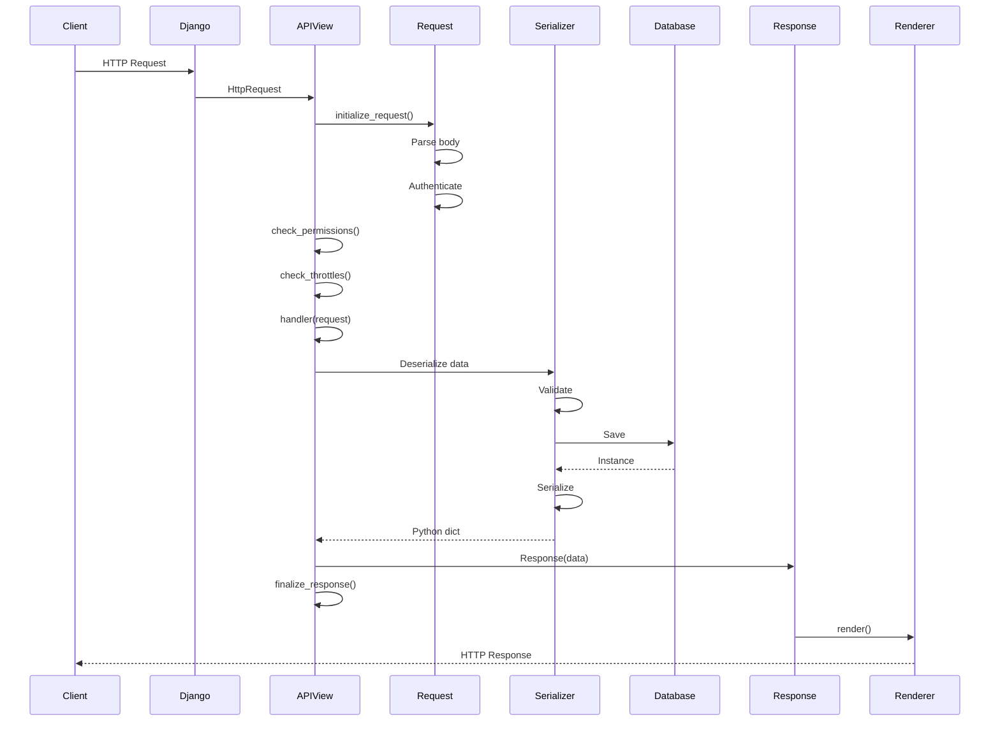

## Overview

Every API request in DRF flows through a well-defined pipeline. Understanding this flow helps you debug issues and customize behavior at the right points.



## The Request Object

DRF wraps Django's `HttpRequest` in its own `Request` class.

### Why Wrap HttpRequest?

```python
# From rest_framework/request.py:1-10
"""
The Request class is used as a wrapper around the standard request object.

The wrapped request then offers a richer API, in particular:

    - content automatically parsed according to `Content-Type` header,
      and available as `request.data`
    - full support of PUT method, including support for file uploads
    - form overloading of HTTP method, content type and content
"""
```

### Creating the Request Wrapper

```python
# From rest_framework/views.py:391-403
def initialize_request(self, request, *args, **kwargs):
    """
    Returns the initial request object.
    """
    parser_context = self.get_parser_context(request)
    
    return Request(
        request,
        parsers=self.get_parsers(),
        authenticators=self.get_authenticators(),
        negotiator=self.get_content_negotiator(),
        parser_context=parser_context
    )
```

### Request Attributes

#### request.data

Unified access to parsed request body:

```python
# Works for JSON, form data, multipart, etc.
def create(self, request):
    title = request.data.get('title')
    content = request.data.get('content')
    # ...
```

<Info>
  Unlike Django's `request.POST` which only works with form data, `request.data` works with any content type that has a parser.
</Info>

#### request.query_params

Semantically correct name for GET parameters:

```python
# Instead of request.GET
search = request.query_params.get('search', '')
page = request.query_params.get('page', 1)
```

#### request.user and request.auth

Authentication information:

```python
if request.user.is_authenticated:
    articles = Article.objects.filter(author=request.user)
else:
    articles = Article.objects.filter(published=True)

# request.auth contains token, session, etc.
if request.auth:
    # Token or other auth credentials
    token = request.auth
```

### Lazy Parsing

Request parsing happens **on-demand**:

```python
# From rest_framework/request.py:218-222
@property
def data(self):
    if not _hasattr(self, '_full_data'):
        with wrap_attributeerrors():
            self._load_data_and_files()
    return self._full_data
```

<Tip>
  The request body is only parsed when you first access `request.data`. This saves processing for requests that don't need the body.
</Tip>

### Content Type Negotiation

DRF automatically selects the right parser:

```python
# From rest_framework/request.py:326-376
def _parse(self):
    """
    Parse the request content, returning a two-tuple of (data, files)
    """
    media_type = self.content_type
    stream = self.stream
    
    parser = self.negotiator.select_parser(self, self.parsers)
    
    if not parser:
        raise exceptions.UnsupportedMediaType(media_type)
    
    try:
        parsed = parser.parse(stream, media_type, self.parser_context)
    except Exception:
        # Fill in empty data on error
        self._data = QueryDict('', encoding=self._request._encoding)
        self._files = MultiValueDict()
        self._full_data = self._data
        raise
    
    return (parsed.data, parsed.files)
```

## The Initial Pipeline

Before your view handler runs, DRF executes several steps:

### 1. Request Initialization

```python
# In dispatch(), first wrap the request
request = self.initialize_request(request, *args, **kwargs)
self.request = request
self.headers = self.default_response_headers
```

### 2. Content Negotiation

```python
# From rest_framework/views.py:405-422
def initial(self, request, *args, **kwargs):
    """Runs anything that needs to occur prior to calling the method handler."""
    self.format_kwarg = self.get_format_suffix(**kwargs)
    
    # Perform content negotiation
    neg = self.perform_content_negotiation(request)
    request.accepted_renderer, request.accepted_media_type = neg
    
    # Determine the API version
    version, scheme = self.determine_version(request, *args, **kwargs)
    request.version, request.versioning_scheme = version, scheme
    
    # Security checks
    self.perform_authentication(request)
    self.check_permissions(request)
    self.check_throttles(request)
```

### 3. Authentication (Lazy)

```python
# From rest_framework/views.py:322-330
def perform_authentication(self, request):
    """
    Perform authentication on the incoming request.
    
    Note that if you override this and simply 'pass', then authentication
    will instead be performed lazily, the first time either
    `request.user` or `request.auth` is accessed.
    """
    request.user  # Trigger authentication
```

#### How Authentication Works

```python
# From rest_framework/request.py:378-395
def _authenticate(self):
    """
    Attempt to authenticate the request using each authentication instance
    in turn.
    """
    for authenticator in self.authenticators:
        try:
            user_auth_tuple = authenticator.authenticate(self)
        except exceptions.APIException:
            self._not_authenticated()
            raise
        
        if user_auth_tuple is not None:
            self._authenticator = authenticator
            self.user, self.auth = user_auth_tuple
            return
    
    self._not_authenticated()  # Set AnonymousUser
```

<Note>
  Authentication runs through each authenticator in order until one succeeds. If all fail, the user is set to `AnonymousUser`.
</Note>

### 4. Permission Checks

```python
# From rest_framework/views.py:332-343
def check_permissions(self, request):
    """
    Check if the request should be permitted.
    Raises an appropriate exception if the request is not permitted.
    """
    for permission in self.get_permissions():
        if not permission.has_permission(request, self):
            self.permission_denied(
                request,
                message=getattr(permission, 'message', None),
                code=getattr(permission, 'code', None)
            )
```

### 5. Throttle Checks

```python
# From rest_framework/views.py:358-377
def check_throttles(self, request):
    """
    Check if request should be throttled.
    Raises an appropriate exception if the request is throttled.
    """
    throttle_durations = []
    for throttle in self.get_throttles():
        if not throttle.allow_request(request, self):
            throttle_durations.append(throttle.wait())
    
    if throttle_durations:
        durations = [
            duration for duration in throttle_durations
            if duration is not None
        ]
        duration = max(durations, default=None)
        self.throttled(request, duration)
```

## The View Handler

After the initial pipeline, your view handler executes:

```python
# From rest_framework/views.py:502-512
try:
    self.initial(request, *args, **kwargs)
    
    # Get the appropriate handler method
    if request.method.lower() in self.http_method_names:
        handler = getattr(self, request.method.lower(),
                          self.http_method_not_allowed)
    else:
        handler = self.http_method_not_allowed
    
    response = handler(request, *args, **kwargs)
```

### Typical Handler Flow

```python
def post(self, request, *args, **kwargs):
    # 1. Get serializer with request data
    serializer = self.get_serializer(data=request.data)
    
    # 2. Validate
    serializer.is_valid(raise_exception=True)
    
    # 3. Save (calls create() or update())
    self.perform_create(serializer)
    
    # 4. Return response
    headers = self.get_success_headers(serializer.data)
    return Response(serializer.data, status=status.HTTP_201_CREATED, headers=headers)
```

## The Response Object

DRF's Response class is initialized with unrendered data:

```python
# From rest_framework/response.py:1-6
"""
The Response class in REST framework is similar to HTTPResponse, except that
it is initialized with unrendered data, instead of a pre-rendered string.

The appropriate renderer is called during Django's template response rendering.
"""
```

### Creating Responses

```python
# Simple response
return Response({'message': 'Hello, world!'})

# With status code
return Response(serializer.data, status=status.HTTP_201_CREATED)

# With headers
return Response(
    serializer.data,
    status=status.HTTP_201_CREATED,
    headers={'Location': '/api/articles/123/'}
)

# Error response
return Response(
    {'error': 'Not found'},
    status=status.HTTP_404_NOT_FOUND
)
```

### Response Initialization

```python
# From rest_framework/response.py:20-47
def __init__(self, data=None, status=None,
             template_name=None, headers=None,
             exception=False, content_type=None):
    """
    Alters the init arguments slightly.
    For example, drop 'template_name', and instead use 'data'.
    
    Setting 'renderer' and 'media_type' will typically be deferred,
    For example being set automatically by the `APIView`.
    """
    super().__init__(None, status=status)
    
    if isinstance(data, Serializer):
        msg = (
            'You passed a Serializer instance as data, but '
            'probably meant to pass serialized `.data` or '
            '`.error`. representation.'
        )
        raise AssertionError(msg)
    
    self.data = data
    self.template_name = template_name
    self.exception = exception
    self.content_type = content_type
    
    if headers:
        for name, value in headers.items():
            self[name] = value
```

<Warning>
  Never pass a serializer instance to Response. Always pass `serializer.data` or `serializer.errors`.
</Warning>

## Response Finalization

After the handler returns, the response is finalized:

```python
# From rest_framework/views.py:424-452
def finalize_response(self, request, response, *args, **kwargs):
    """
    Returns the final response object.
    """
    assert isinstance(response, HttpResponseBase), (
        'Expected a `Response`, `HttpResponse` or `StreamingHttpResponse` '
        'to be returned from the view, but received a `%s`'
        % type(response)
    )
    
    if isinstance(response, Response):
        if not getattr(request, 'accepted_renderer', None):
            neg = self.perform_content_negotiation(request, force=True)
            request.accepted_renderer, request.accepted_media_type = neg
        
        response.accepted_renderer = request.accepted_renderer
        response.accepted_media_type = request.accepted_media_type
        response.renderer_context = self.get_renderer_context()
    
    # Add vary headers
    vary_headers = self.headers.pop('Vary', None)
    if vary_headers is not None:
        patch_vary_headers(response, cc_delim_re.split(vary_headers))
    
    for key, value in self.headers.items():
        response[key] = value
    
    return response
```

## Rendering

The response is rendered by Django's TemplateResponse system:

```python
# From rest_framework/response.py:54-85
@property
def rendered_content(self):
    renderer = getattr(self, 'accepted_renderer', None)
    accepted_media_type = getattr(self, 'accepted_media_type', None)
    context = getattr(self, 'renderer_context', None)
    
    assert renderer, ".accepted_renderer not set on Response"
    assert accepted_media_type, ".accepted_media_type not set on Response"
    assert context is not None, ".renderer_context not set on Response"
    context['response'] = self
    
    media_type = renderer.media_type
    charset = renderer.charset
    content_type = self.content_type
    
    if content_type is None and charset is not None:
        content_type = f"{media_type}; charset={charset}"
    elif content_type is None:
        content_type = media_type
    self['Content-Type'] = content_type
    
    ret = renderer.render(self.data, accepted_media_type, context)
    if isinstance(ret, str):
        return ret.encode(charset)
    
    return ret
```

### How Renderers Work

```python
class JSONRenderer:
    media_type = 'application/json'
    charset = 'utf-8'
    
    def render(self, data, accepted_media_type=None, renderer_context=None):
        if data is None:
            return b''
        return json.dumps(data).encode(self.charset)
```

## Exception Handling

Exceptions are caught and converted to responses:

```python
# From rest_framework/views.py:454-478
def handle_exception(self, exc):
    """
    Handle any exception that occurs, by returning an appropriate response,
    or re-raising the error.
    """
    if isinstance(exc, (exceptions.NotAuthenticated,
                        exceptions.AuthenticationFailed)):
        # WWW-Authenticate header for 401 responses
        auth_header = self.get_authenticate_header(self.request)
        
        if auth_header:
            exc.auth_header = auth_header
        else:
            exc.status_code = status.HTTP_403_FORBIDDEN
    
    exception_handler = self.get_exception_handler()
    context = self.get_exception_handler_context()
    response = exception_handler(exc, context)
    
    if response is None:
        self.raise_uncaught_exception(exc)
    
    response.exception = True
    return response
```

### The Default Exception Handler

```python
# From rest_framework/views.py:72-102
def exception_handler(exc, context):
    """
    Returns the response that should be used for any given exception.
    
    By default we handle the REST framework `APIException`, and also
    Django's built-in `Http404` and `PermissionDenied` exceptions.
    """
    if isinstance(exc, Http404):
        exc = exceptions.NotFound(*(exc.args))
    elif isinstance(exc, PermissionDenied):
        exc = exceptions.PermissionDenied(*(exc.args))
    
    if isinstance(exc, exceptions.APIException):
        headers = {}
        if getattr(exc, 'auth_header', None):
            headers['WWW-Authenticate'] = exc.auth_header
        if getattr(exc, 'wait', None):
            headers['Retry-After'] = '%d' % exc.wait
        
        if isinstance(exc.detail, (list, dict)):
            data = exc.detail
        else:
            data = {'detail': exc.detail}
        
        set_rollback()  # Rollback database on error
        return Response(data, status=exc.status_code, headers=headers)
    
    return None  # Let Django handle it (500 error)
```

### Custom Exception Handler

```python
from rest_framework.views import exception_handler

def custom_exception_handler(exc, context):
    # Call REST framework's default exception handler first
    response = exception_handler(exc, context)
    
    if response is not None:
        # Add custom error code
        response.data['error_code'] = getattr(exc, 'code', 'unknown')
        
        # Add request info for debugging
        if settings.DEBUG:
            response.data['path'] = context['request'].path
            response.data['method'] = context['request'].method
    
    return response

# In settings.py
REST_FRAMEWORK = {
    'EXCEPTION_HANDLER': 'myapp.utils.custom_exception_handler'
}
```

## Complete Request Flow Example

Let's trace a complete POST request:

```python
# 1. Client sends request
POST /api/articles/
Content-Type: application/json
Authorization: Token abc123

{"title": "DRF Deep Dive", "content": "..."}
```

```python
# 2. Django routes to ViewSet
class ArticleViewSet(viewsets.ModelViewSet):
    queryset = Article.objects.all()
    serializer_class = ArticleSerializer
    authentication_classes = [TokenAuthentication]
    permission_classes = [IsAuthenticated]
```

```python
# 3. APIView.dispatch() is called
def dispatch(self, request, *args, **kwargs):
    # a. Wrap request
    request = self.initialize_request(request)
    # b. Run initial pipeline
    self.initial(request)
```

```python
# 4. initial() pipeline
def initial(self, request):
    # a. Content negotiation
    request.accepted_renderer = JSONRenderer()
    request.accepted_media_type = 'application/json'
    
    # b. Authentication (lazy)
    self.perform_authentication(request)
    # -> TokenAuthentication.authenticate(request)
    # -> request.user = User.objects.get(token='abc123')
    
    # c. Permission check
    self.check_permissions(request)
    # -> IsAuthenticated.has_permission(request, view)
    # -> return request.user.is_authenticated
    
    # d. Throttle check
    self.check_throttles(request)
```

```python
# 5. Handler method (from CreateModelMixin)
def create(self, request, *args, **kwargs):
    # a. Get serializer with data
    serializer = self.get_serializer(data=request.data)
    
    # b. Validate
    serializer.is_valid(raise_exception=True)
    # -> serializer.to_internal_value(data)
    # -> serializer.run_validators()
    # -> serializer.validate()
    
    # c. Save
    self.perform_create(serializer)
    # -> serializer.save(author=request.user)
    # -> serializer.create(validated_data)
    # -> Article.objects.create(**validated_data)
    
    # d. Return response
    headers = self.get_success_headers(serializer.data)
    return Response(
        serializer.data,
        status=status.HTTP_201_CREATED,
        headers=headers
    )
```

```python
# 6. finalize_response()
def finalize_response(self, request, response):
    # a. Set renderer
    response.accepted_renderer = request.accepted_renderer
    response.accepted_media_type = request.accepted_media_type
    
    # b. Set renderer context
    response.renderer_context = {
        'view': self,
        'request': request,
    }
    
    # c. Add headers
    response['Location'] = '/api/articles/123/'
    
    return response
```

```python
# 7. Render response
response.rendered_content
# -> JSONRenderer.render(response.data)
# -> json.dumps({'id': 123, 'title': 'DRF Deep Dive', ...})
```

```python
# 8. Send to client
HTTP/1.1 201 Created
Content-Type: application/json
Location: /api/articles/123/

{"id": 123, "title": "DRF Deep Dive", "content": "...", "author": 1}
```

## Customization Points

You can customize the request-response cycle at many points:

### 1. Request Parsing

```python
class MyView(APIView):
    parser_classes = [JSONParser, FormParser, MultiPartParser]
```

### 2. Authentication

```python
class MyView(APIView):
    authentication_classes = [SessionAuthentication, TokenAuthentication]
    
    def perform_authentication(self, request):
        # Custom authentication logic
        super().perform_authentication(request)
```

### 3. Permissions

```python
class MyView(APIView):
    permission_classes = [IsAuthenticated, IsOwner]
    
    def check_permissions(self, request):
        # Additional permission checks
        super().check_permissions(request)
        if not self.custom_check():
            self.permission_denied(request)
```

### 4. Handler Execution

```python
class MyViewSet(viewsets.ModelViewSet):
    def create(self, request, *args, **kwargs):
        # Pre-processing
        data = self.preprocess_data(request.data)
        
        # Standard create
        response = super().create(request, *args, **kwargs)
        
        # Post-processing
        self.send_notification(response.data)
        
        return response
```

### 5. Response Rendering

```python
class MyView(APIView):
    renderer_classes = [JSONRenderer, BrowsableAPIRenderer]
    
    def finalize_response(self, request, response, *args, **kwargs):
        # Custom headers or processing
        response = super().finalize_response(request, response, *args, **kwargs)
        response['X-Custom-Header'] = 'value'
        return response
```

### 6. Exception Handling

```python
class MyView(APIView):
    def handle_exception(self, exc):
        # Custom exception logic
        if isinstance(exc, MyCustomException):
            return Response({'error': str(exc)}, status=400)
        return super().handle_exception(exc)
```

## Performance Considerations

### 1. Lazy Authentication

Authentication doesn't run until `request.user` is accessed:

```python
def get(self, request):
    # No authentication yet
    if 'skip_auth' in request.query_params:
        return Response({'status': 'ok'})
    
    # Authentication runs here
    if request.user.is_authenticated:
        return Response({'user': request.user.username})
```

### 2. Lazy Parsing

Request body isn't parsed until `request.data` is accessed:

```python
def delete(self, request, pk):
    # No parsing needed for DELETE
    obj = self.get_object()
    obj.delete()
    return Response(status=204)
```

### 3. Database Optimization

```python
class ArticleViewSet(viewsets.ModelViewSet):
    def get_queryset(self):
        # Optimize based on action
        queryset = Article.objects.all()
        
        if self.action == 'list':
            queryset = queryset.only('id', 'title', 'created')
        elif self.action == 'retrieve':
            queryset = queryset.select_related('author').prefetch_related('tags')
        
        return queryset
```

## Summary

The DRF request-response cycle:

1. **Request wrapping**: Django HttpRequest → DRF Request
2. **Initial pipeline**: Content negotiation, authentication, permissions, throttling
3. **Handler execution**: Your view logic runs
4. **Response creation**: Data → Response object
5. **Response finalization**: Set renderer, add headers
6. **Rendering**: Python dict → JSON/XML/etc
7. **Exception handling**: Catches and formats errors at any point

<Info>
  Every step is customizable through method overrides or policy classes. Start with defaults and override only what you need.
</Info>